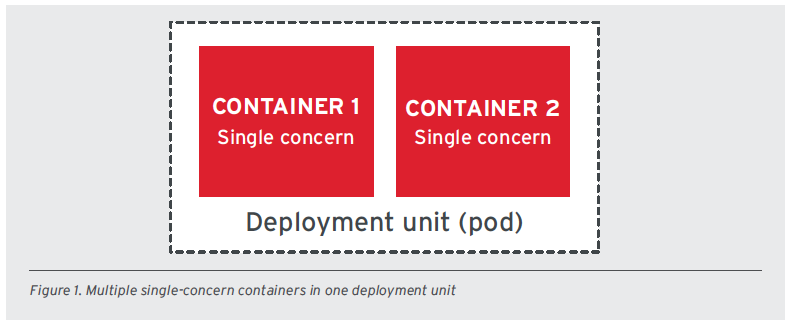
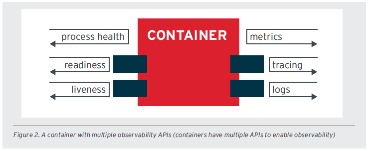
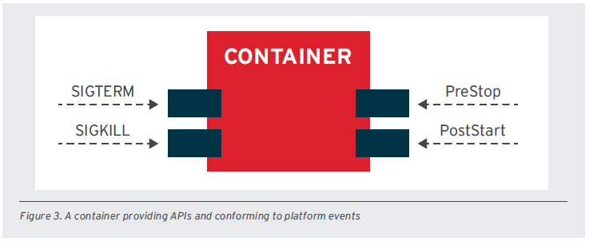

软件设计原则：

* 保持简单，愚蠢（KISS） 
* 不要重复自己（DRY） 
* 你不会需要它 （YAGNI） 
* 关注点分离（SoC） 
* Single responsibility, Open/closed, Liskov substitution, Interface segregation, Dependency inversion （SOLID） 

基本容器最佳实践：

* 目标小镜像
* 支持任意用户ID
* 标记重要的端口
* 为持久数据使用卷
* 设置镜像元数据
* 同步主机和镜像

Red Hat的云原生容器：

* 唯一关注性原则（SCP） 
* 高度可观测性原则（HOP） 
* 生命周期一致性原则（LCP） 
* 镜像不可变性原则（IIP） 
* 流程可处置性原则（PDP） 
* 自遏制性原则（S-CP） 
* 运行时间约束性原则（RCP）

## 唯一关注性原则（SCP）

在许多方面，唯一关注性原则-SINGLE CONCERN PRINCIPLE（SCP）原则与来自SOLID的SRP是类似的，它建议一个类应该只有一个责任。SRP背后的动机是每个责任是变更的一个轴心，一个类应该有，且也只有一个需要改变的理由。SCP原则中的“关注”一词强调关注是一种更高层次的抽象的责任，而且它更好地将范围描述为一个容器而不是一个类。虽然SRP的主要动机是变化原因的唯一性，而SCP的主要动机是容器镜像重用和可替换性。如果你创建一个解决单个问题的容器，并且以功能完整的方式来实现，不同应用程序中的容器镜像重用的可能性就会更高。 

因此，SCP原则规定每个集容器都应该解决一个问题，并做得很好。 实现这一点，通常比在面向对象的世界中实现SRP更容易，容器通常管理的一个单一的进程，大多数情况下一个进程解决一个问题。

如果你的容器化微服务需要解决多个问题，它可以使用这样的模式，将多个容器用sidecar和init-containers的模式合并成一个部署单元（pod），这样每个容器仍然是处理单个问题。同样，您可以替换处理同样问题的容器。 例如，将Web服务器容器或队列实现容器，更新为更具可扩展性的容器。 

## 高度可观测性原理（HOP） 

容器提供了一种统一的方式来打包和运行应用程序，将它们视为一个黑盒子对象。 但任何旨在成为云原生公民的容器都必须提供API支持，要为运行时环境编写接口（API），以观察容器的健康状况和行为。 这是自动化容器更新和生命周期回收的基本先决条件和统一的方式，从而提高系统的弹性和用户体验。

实际上，您的容器化应用程序必须至少为其提供不同类型的健康检查的API--活动和就绪等状态。更好的应用程序的行为则必须提供其他手段来观察容器化应用程序的状态。应用程序应该将重要事件记录到标准错误（STDERR）和标准输出（STDOUT）中，从而通过统一的日志聚合工具（诸如Fluentd和Logstash之类的工具）进行分析，并与跟踪和指标收集库相结合，例如OpenTracing，Prometheus等。

将您的应用程序视为黑盒子，但实施所有必要的API以帮助平台对其进行观测，并以最佳方式管理您的应用程序。 

## 生命周期一致性原则（LCP） 

HOP规定了你的容器提供供平台观测的API。 LCP则规定：您的应用程序有办法读取来自平台的事件。 此外，除了获得事件以外，容器还应该对这些事件相应地作出反应。这就是此原则名字由来。这几乎就像在应用程序通过一个“写入API”与平台进行交互。

来自管理平台的各种事件都是为了帮助您管理您的容器的生命周期的。决定处理哪些事件取决于您的应用程序 以及是否对这些事件做出反应。

但有些事件比其他事件更重要。例如，任何需要一个干净的关闭进程，这就需要捕获信号：终止（SIGTERM）消息，并尽可能迅速关闭。 这是为了避免通过强制关闭信号：kill（SIGKILL），之后跟随一个SIGTERM。

还有其他事件，例如PostStart和PreStop，可能对您的应用程序生命周期管理也非常重要。 例如，某些应用程序需要在服务之前进行预热 请求和一些需要在关闭干净之前释放资源。 IMAGE IMMUTABILITY PRINCIPLE（IIP） 容器化的应用程序是不可改变的，一旦建成，预计不会改变 在不同的环境中。 这意味着使用存储运行时的外部手段 数据并依赖于跨环境变化的外部配置，而不是创建 或每个环境修改容器。 容器应用程序中的任何更改都应该如此 导致构建新的容器映像并在所有环境中重用它。 原理相同 以不可变的服务器/基础架构的名义也很受欢迎，并且用于服务器/ 年龄也是如此。

遵循IIP原则应该防止为不同的环境创建类似的容器图像， ronments，但坚持为每个环境配置一个容器映像。 这个原则允许 在应用程序更新期间采用自动回滚和前滚等做法， 云本地自动化的重要方面。 工艺可用性原则（PDP） 迁移到容器应用程序的主要动机之一是容器需要 尽可能短暂并准备好在任何时候被另一个容器实例替换 时间。 有很多原因需要更换容器，比如健康检查失败，缩小等 应用程序，将容器迁移到不同的主机，平台资源匮乏或 另一个问题。

这意味着容器化的应用程序必须保持其状态为外部化或分布式 多余的。 这也意味着应用程序应该快速启动和关闭，甚至 准备好突然，完整的硬件故障。 实施这一原则的另一个有用的做法是创建小容器。 容器在 云本地环境可以自动调度并在不同的主机上启动。 有 较小的容器导致启动时间更快，因为在重新启动之前容器需要 被物理复制到主机系统。 自我保护原则（S-CP） 这个原则规定一个容器应该包含构建时需要的所有东西。 缺点- tainer应该仅仅依赖于 Linux®内核的存在并添加任何额外的库 在容器建成时进入它。 除了图书馆之外，它还应该包含诸如此类的东西 作为语言运行时，应用程序平台（如果需要）以及运行所需的其他依赖关系 容器化的应用程序。

唯一的例外是诸如不同环境之间不同的配置等 并且必须在运行时提供; 例如，通过Kubernetes ConfigMap。 某些应用程序由多个容器组件组成。 例如，容器 - Web化应用程序也可能需要数据库容器。 这个原则不建议合并 两个容器。 相反，它表明数据库容器包含运行所需的所有内容 数据库和Web应用程序容器包含运行Web应用程序所需的所有内容， 如Web服务器。 在运行时，Web应用程序容器将依赖于并访问该容器 数据库容器根据需要。 运行时约束原则（RCP） S-CP从构建时间的角度查看容器，并查看生成的二进制文件及其内容。 但是容器不仅仅是磁盘上一个尺寸的单维黑盒子。 容器有 运行时的多个维度，例如内存使用维度，CPU使用维度等 资源消耗维度。

这个RCP原则建议每个容器申报资源需求并通过 信息到平台。 它应该根据CPU共享容器的资源配置文件， 内存，网络，磁盘影响平台如何执行调度，自动扩展，容量 管理以及容器的一般服务级别协议（SLA）。 除了通过容器的资源需求之外，还有一点很重要， 阳离子仅限于指定的资源要求。 如果应用程序保持受限，则 当资源匮乏发生时，平台不太可能将其视为终止和迁移。

结论 云本身不仅仅是一种最终状态 - 它是一种工作方式。 这份白皮书描述了一个 代表容器应用的基本准则的原则数量 必须遵守才能成为优秀的云计算公民。 除了这些原则之外，创建良好的容器应用程序还需要熟悉 其他容器相关的最佳实践和技术。 尽管上述原则 更基本，适用于大多数用例，下面列出的最佳实践需要判断 - 何时申请或不申请。 以下是一些与容器相关的常见问题 最佳实践： •瞄准小图像。 通过清理临时文件并避免出现较小的图像 安装不必要的软件包。 这减少了容器的尺寸，构建时间和网络 时间复制容器图像。 •支持任意用户ID。 避免使用sudo命令或要求特定用户名 运行你的容器。 •标记重要的端口。 虽然可以在运行时指定端口号，但可以指定 他们使用EXPOSE命令可以更轻松地使用人员和软件 你的形象。 •将卷用于持久数据。 在容器后需要保存的数据 销毁必须写入一个卷。 •设置图像元数据。 以标签，标签和注释形式存在的图像元数据可以使您的 容器图像更加实用，从而为开发人员提供了更好的体验 你的图片。 •同步主机和图像。 一些容器应用需要容器 在某些属性（如时间和机器ID）上与主机同步。 这里是指向具有模式和最佳实践的资源的链接，以帮助您实现上述目标， 列举的原则更有效： • https://www.slideshare.net/luebken/container-patterns • https://docs.docker.com/engine/userguide/eng-image/dockerfile_best-practices • http://docs.projectatomic.io/container-best-practices • https://docs.openshift.com/enterprise/3.0/creating_images/guidelines.html • https://www.usenix.org/system/files/conference/hotcloud16/hotcloud16_burns.pdf • https://leanpub.com/k8spatterns/ • https://12factor.net

